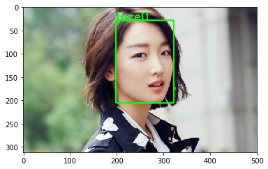
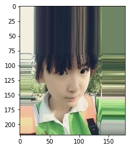
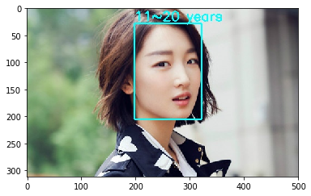

<font size=6>**实现方式：基于飞桨的pyramidbox_lite_server模型和ResNet50_vd_ssld模型**</font>
<br><br><br>
&emsp;&emsp;&emsp;&emsp;<font size=5.5>**①pyramidbox_lite_server模型**</font>
<br><br>
&emsp;&emsp;&emsp;&emsp;&emsp;&emsp;&emsp;&emsp;<font size=4.5>PyramidBox-Lite是基于2018年百度发表于计算机视觉顶级会议ECCV 2018的论文PyramidBox而研发的轻量级模型，模型基于主干网络FaceBoxes，对于光照、口罩遮挡、表情变化、尺度变化等常见问题具有很强的鲁棒性。该PaddleHub Module基于WIDER FACE数据集和百度自采人脸数据集进行训练，支持预测，可用于人脸检测。</font>
<br><br>
&emsp;&emsp;&emsp;&emsp;<font size=5.5>**②ResNet50_vd_ssld模型**</font>
<br><br>
&emsp;&emsp;&emsp;&emsp;&emsp;&emsp;&emsp;&emsp;<font size=4.5>由于各个年龄段的人的色斑、皱纹、皮肤状况都有一定的差异，提供了一定的特征，本项目基于分类的方法对年龄进行预测判断</font>
<br><br>
&emsp;&emsp;&emsp;&emsp;&emsp;&emsp;&emsp;&emsp;<font size=4.5>ResNet50_vd_ssld实现原理请移步到至官方介绍学习：[介绍](https://blog.csdn.net/weixin_45449540/article/details/106798605?ops_request_misc=%257B%2522request%255Fid%2522%253A%2522159512766219195239841908%2522%252C%2522scm%2522%253A%252220140713.130102334..%2522%257D&request_id=159512766219195239841908&biz_id=0&utm_medium=distribute.pc_search_result.none-task-blog-2~all~first_rank_ecpm_v3~pc_rank_v2-1-106798605.first_rank_ecpm_v3_pc_rank_v2&utm_term=ResNet50_vd_ssld)</font>
<br><br>

<br><br>
<font size=5>**项目目录**</font>
<br><br>
&emsp;&emsp;&emsp;&emsp;<font size=5>1.部署pyramidbox_lite_server模型</font>
<br><br>
&emsp;&emsp;&emsp;&emsp;<font size=5>2.获取年龄预测数据集</font>
<br><br>
&emsp;&emsp;&emsp;&emsp;<font size=5>3.开始年龄预测模型的训练</font>
<br><br>
&emsp;&emsp;&emsp;&emsp;<font size=5>4.实现年龄预测</font>
<br><br>
&emsp;&emsp;&emsp;&emsp;<font size=5>5.结合pyramidbox_lite_server模型和年龄预测模型实现完整功能</font>
<br><br><br><br>

<font size=5>**1.部署pyramidbox_lite_server模型**</font>

&emsp;&emsp;&emsp;&emsp;<font size=4>**1.1.安装PaddleHub并导入pyramidbox_lite_server模型**</font>


```python
!pip install paddlehub -i https://mirror.baidu.com/pypi/simple
!hub install pyramidbox_lite_server==1.2.0
```

&emsp;&emsp;&emsp;&emsp;<font size=4>**1.2.查看效果(周冬雨我女神啊啊啊啊)**</font>


```python
import paddlehub as hub
import cv2
import matplotlib.pyplot as plt

face_detector = hub.Module(name="pyramidbox_lite_server")
result = face_detector.face_detection(images=[cv2.imread('test.jpg')])

img = cv2.imread('test.jpg')
b,g,r = cv2.split(img)
img = cv2.merge([r,g,b])
font = cv2.FONT_HERSHEY_SIMPLEX

for i in range(len(result[0]['data'])):
    cv2.rectangle(img, (int(result[0]['data'][i]['left']), int(result[0]['data'][i]['top'])), (int(result[0]['data'][i]['right']), int(result[0]['data'][i]['bottom'])), (0, 255, 0), thickness=2) 
    cv2.putText(img, 'face'+str(i), (int(result[0]['data'][i]['left']), int(result[0]['data'][i]['top'])), font, 0.8, (0, 255, 0), 2)

#保存图片
cv2.imwrite('show.jpg', img)

# 显示图片
img = cv2.imread('show.jpg')
%matplotlib inline
plt.imshow(img)
plt.show()
```

    [2020-07-26 02:20:02,749] [    INFO] - Installing pyramidbox_lite_server module
    [2020-07-26 02:20:02,751] [    INFO] - Module pyramidbox_lite_server already installed in /home/aistudio/.paddlehub/modules/pyramidbox_lite_server





<font size=5>**2.获取年龄预测数据集**</font>
<br><br>
&emsp;&emsp;&emsp;&emsp;<font size=4>数据集的预处理作者已经帮你准备好了，直接解压就可以看到`dataset/train.txt`、`dataset/val.txt`和`dataset/labels.txt`了</font>


```python
## 解压数据集

!unzip data/data45324/megaage_asian.zip -d /home/aistudio/
!mv megaage_asian dataset
```

<font size=5>**3.开始年龄预测模型的训练**</font>


```python
## 安装paddleX

!pip install paddlex -i https://mirror.baidu.com/pypi/simple
```

&emsp;&emsp;&emsp;&emsp;<font size=4>**3.1.设置使用0号GPU卡**</font>


```python
import matplotlib
matplotlib.use('Agg') 
import os
os.environ['CUDA_VISIBLE_DEVICES'] = '0'
import paddlex as pdx
```

&emsp;&emsp;&emsp;&emsp;<font size=4>**3.2.图像预处理+数据增强**</font>


```python
from paddlex.cls import transforms
train_transforms = transforms.Compose([
    transforms.RandomCrop(crop_size=224),
    transforms.RandomHorizontalFlip(),
    transforms.Normalize()
])
eval_transforms = transforms.Compose([
    transforms.ResizeByShort(short_size=256),
    transforms.CenterCrop(crop_size=224),
    transforms.Normalize()
])
```

&emsp;&emsp;&emsp;&emsp;<font size=4>**3.3.数据迭代器的定义**</font>


```python
train_dataset = pdx.datasets.ImageNet(
    data_dir='dataset',
    file_list='dataset/train.txt',
    label_list='dataset/labels.txt',
    transforms=train_transforms,
    shuffle=True)
eval_dataset = pdx.datasets.ImageNet(
    data_dir='dataset',
    file_list='dataset/val.txt',
    label_list='dataset/labels.txt',
    transforms=eval_transforms)
```

&emsp;&emsp;&emsp;&emsp;<font size=4>**3.4.开始炼丹**</font>


```python
num_classes = len(train_dataset.labels)
model = pdx.cls.ResNet50_vd_ssld(num_classes=num_classes)
model.train(num_epochs = 60,
            save_interval_epochs = 10,
            train_dataset = train_dataset,
            train_batch_size = 64,
            eval_dataset = eval_dataset,
            learning_rate = 0.025,
            warmup_steps = 1804,
            warmup_start_lr = 0.0001,
            lr_decay_epochs=[20, 40],
            lr_decay_gamma = 0.025,    
            save_dir='/home/aistudio',
            use_vdl=True)
```

<font size=5>**4.实现年龄预测**</font>


```python
import cv2
import matplotlib.pyplot as plt

# 加载模型
print('**************************************加载模型*****************************************')
model = pdx.load_model('best_model')

path = 'dataset/val/560.jpg'

# 显示图片
img = cv2.imread(path)
b,g,r = cv2.split(img)
img = cv2.merge([r,g,b])
%matplotlib inline
plt.imshow(img)

# 预测
result = model.predict(path, topk=3)
print('**************************************预测*****************************************')
print(result[0])
```

    2020-07-26 02:33:51,849-INFO: font search path ['/opt/conda/envs/python35-paddle120-env/lib/python3.7/site-packages/matplotlib/mpl-data/fonts/ttf', '/opt/conda/envs/python35-paddle120-env/lib/python3.7/site-packages/matplotlib/mpl-data/fonts/afm', '/opt/conda/envs/python35-paddle120-env/lib/python3.7/site-packages/matplotlib/mpl-data/fonts/pdfcorefonts']
    2020-07-26 02:33:52,183-INFO: generated new fontManager


    **************************************加载模型*****************************************
    2020-07-26 02:33:56 [INFO]	Model[ResNet50_vd_ssld] loaded.
    **************************************预测*****************************************
    {'category_id': 1, 'category': '11~20', 'score': 0.979259}





<font size=5>**5.结合pyramidbox_lite_server模型和年龄预测模型实现完整功能**</font>


```python
import paddlehub as hub
import cv2
import matplotlib.pyplot as plt

# 加载检测年龄模型
print('**************************************加载模型*****************************************')
model = pdx.load_model('best_model')

# 预测
result0 = model.predict('test.jpg', topk=3)
print('**************************************预测*****************************************')
print(result0[0]['category'])

# 加载检测人脸模型
face_detector = hub.Module(name="pyramidbox_lite_server")
result = face_detector.face_detection(images=[cv2.imread('test.jpg')])

img = cv2.imread('test.jpg')
font = cv2.FONT_HERSHEY_SIMPLEX

for i in range(len(result[0]['data'])):
    cv2.rectangle(img, (int(result[0]['data'][i]['left']), int(result[0]['data'][i]['top'])), (int(result[0]['data'][i]['right']), int(result[0]['data'][i]['bottom'])), (255, 255, 0), thickness=2) 
    cv2.putText(img, result0[0]['category']+' years', (int(result[0]['data'][i]['left']), int(result[0]['data'][i]['top'])-5), font, 0.8, (255, 255, 0), 2)

#保存图片
cv2.imwrite('show.jpg', img)

# 显示图片
img = cv2.imread('show.jpg')
b,g,r = cv2.split(img)
img = cv2.merge([r,g,b])
%matplotlib inline
plt.imshow(img)
plt.show()
```

    **************************************加载模型*****************************************
    2020-07-26 02:48:40 [INFO]	Model[ResNet50_vd_ssld] loaded.
    **************************************预测*****************************************
    11~20


    [2020-07-26 02:48:40,759] [    INFO] - Installing pyramidbox_lite_server module
    [2020-07-26 02:48:40,761] [    INFO] - Module pyramidbox_lite_server already installed in /home/aistudio/.paddlehub/modules/pyramidbox_lite_server



